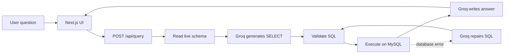

# AI-Powered-Database-Query-Assistant


> Ask questions in plain English. Get safe, read-only MySQL queries and concise answers.

AI-Powered-Database-Query-Assistant is a full-stack natural-language interface for exploring a MySQL database. It reads the live database schema, asks Groq to generate a SQL query, validates that query before execution, and converts the returned rows into a short human-readable answer.

The primary application is a Next.js app designed for local development. A legacy Streamlit/LangChain implementation is also included under [`app/`](app/).

## ✨ Features

- Natural-language questions over MySQL data
- Groq-powered SQL generation and answer generation
- Runtime schema discovery from `INFORMATION_SCHEMA`
- Foreign-key relationship discovery to improve joins
- Read-only SQL guardrails
- Automatic `LIMIT 100` protection for unbounded queries
- One automatic SQL repair attempt after a database error
- Conversation history support
- SQL and result rows available in the interface for transparency
- TLS support for hosted MySQL providers such as Aiven
- Evaluation harness for execution success, latency, repair recovery, and result accuracy

## 🧭 How it works



1. The browser sends a question and recent conversation history to `/api/query`.
2. The server loads tables, columns, types, keys, and foreign-key relationships from MySQL.
3. Groq generates one MySQL `SELECT` query using that schema.
4. The server rejects mutating SQL and multiple statements, then executes the query.
5. If execution fails, the server gives Groq one opportunity to repair the query.
6. Groq summarizes only the returned rows and sends the answer to the browser.

## 🛠️ Technology stack

| Layer | Technology |
| --- | --- |
| Frontend | Next.js 15, React 19, TypeScript |
| LLM provider | Groq API via `groq-sdk` |
| Default model | `openai/gpt-oss-120b` |
| Database | MySQL via `mysql2` |
| Hosting target | Vercel or any Node.js-compatible host |
| Optional legacy app | Python, Streamlit, LangChain, `langchain-groq` |

## 🚀 Quick start

### Prerequisites

- Node.js 18 or newer
- A Groq API key
- A reachable MySQL 8 database
- A MySQL user with read-only permissions recommended

### Install dependencies

```powershell
npm install
```

### Configure environment variables

Create a local environment file:

```powershell
Copy-Item .env.example .env.local
```

Then fill in `.env.local`:

```env
GROQ_API_KEY=your_groq_api_key
GROQ_MODEL=openai/gpt-oss-120b

AIVEN_MYSQL_HOST=your_mysql_host
AIVEN_MYSQL_PORT=3306
AIVEN_MYSQL_USER=your_mysql_user
AIVEN_MYSQL_PASSWORD=your_mysql_password
AIVEN_MYSQL_DATABASE=your_database
AIVEN_MYSQL_SSL=true
AIVEN_MYSQL_CA_CERT_BASE64=your_base64_encoded_ca_certificate
```

The database layer also accepts the equivalent generic names `MYSQL_HOST`, `MYSQL_PORT`, `MYSQL_USER`, `MYSQL_PASSWORD`, and `MYSQL_DATABASE`.

Never expose `GROQ_API_KEY` or database credentials through variables beginning with `NEXT_PUBLIC_`. Do not commit `.env.local`.

### Configure the MySQL CA certificate

For Aiven or another TLS-enabled provider, base64-encode the CA certificate. On PowerShell:

```powershell
[Convert]::ToBase64String([IO.File]::ReadAllBytes("ca.pem"))
```

Copy the output into `AIVEN_MYSQL_CA_CERT_BASE64`. See [`database/README.md`](database/README.md) for the Classic Models setup.

### Start the application

```powershell
npm run dev
```

Open [http://localhost:3000](http://localhost:3000).

## 🗄️ Database setup

The application does not depend on a hard-coded table list. It discovers the live schema on every request, so you can use the included Classic Models database or your own MySQL schema.

The repository includes [`mysqlsampledatabase.sql`](mysqlsampledatabase.sql). To import it into a local MySQL database:

```bash
mysql -h HOST -P 3306 -u USER -p classicmodels < mysqlsampledatabase.sql
```

For Aiven-specific connection and certificate instructions, read [`database/README.md`](database/README.md).

## 🔒 Safety model

The application is intended for analytics and read-only exploration:

- The prompt instructs Groq to generate MySQL `SELECT` queries only.
- The server removes Markdown fences and extracts the SQL statement.
- Only queries beginning with `SELECT` or `WITH` are accepted.
- Multiple SQL statements are rejected.
- Mutating keywords such as `INSERT`, `UPDATE`, `DELETE`, `DROP`, and `ALTER` are rejected.
- Queries without a limit receive `LIMIT 100`.
- A read-only MySQL database user is still strongly recommended as the final protection layer.

These checks reduce risk but should not replace database permissions, network controls, and normal production security practices.

## 📊 Evaluation

The evaluation harness runs the questions in [`test_queries.txt`](test_queries.txt) against the local API and writes:

- [`eval/results.json`](eval/results.json): per-question SQL, rows, status, repair flag, and latency
- [`EVALUATION_REPORT.md`](EVALUATION_REPORT.md): aggregate success, accuracy, repair, latency, and category metrics

Start the app first, then run:

```powershell
npm run evaluate -- http://localhost:3000
```

For result accuracy, create `eval/gold_results.json` from [`eval/gold_results.example.json`](eval/gold_results.example.json) and add the expected rows. Without gold results, the harness can measure execution and latency but reports result accuracy as `N/A`.

The evaluator stops when the Groq API returns a rate-limit error. Groq token limits are organization-level, so a complete 100-question run may require sufficient account capacity.

More details are available in [`eval/README.md`](eval/README.md).

## 🐍 Optional Streamlit implementation

The original LangChain/Streamlit version is retained under [`app/`](app/). To use it:

```powershell
pip install -r app/requirements.txt
streamlit run app/main.py
```

It uses the same `GROQ_API_KEY` and `GROQ_MODEL` variables. The Next.js application is the recommended primary interface.

## 📁 Project structure

```text
.
├── app/
│   ├── api/query/route.ts       # Natural-language query endpoint
│   ├── api/schema/route.ts      # Connected-table endpoint
│   ├── page.tsx                 # Chat interface
│   └── *.py                     # Optional Streamlit/LangChain app
├── src/lib/
│   ├── database.ts              # MySQL pool and schema discovery
│   ├── groq.ts                  # Groq prompts and completions
│   └── query.ts                 # SQL validation and history formatting
├── database/                    # Database setup notes
├── eval/                        # Evaluation documentation and fixtures
├── scripts/evaluate.mjs         # Evaluation runner
├── .env.example                 # Environment variable template
└── mysqlsampledatabase.sql      # Classic Models sample schema/data
```

## 📜 Available commands

| Command | Description |
| --- | --- |
| `npm run dev` | Start the Next.js development server |
| `npm run build` | Create a production build |
| `npm run start` | Start the production server |
| `npm run evaluate -- http://localhost:3000` | Run the evaluation harness |

## ☁️ Deploy to Vercel

1. Push the repository to GitHub.
2. Import it into Vercel as a Next.js project.
3. Add the variables from `.env.example` under Vercel Project Settings → Environment Variables.
4. Confirm that the MySQL provider accepts connections from Vercel and that TLS settings are correct.
5. Deploy the project.

Keep the Groq key and database credentials server-side. The browser only communicates with the application’s API routes.

## 🤝 Contributing

1. Create a feature branch.
2. Make the change and update documentation when behavior changes.
3. Run `npm run build`.
4. Add or update evaluation questions where appropriate.
5. Open a pull request with a clear description.

## 📄 License

No license file is currently included. Add a license before distributing the project publicly.
